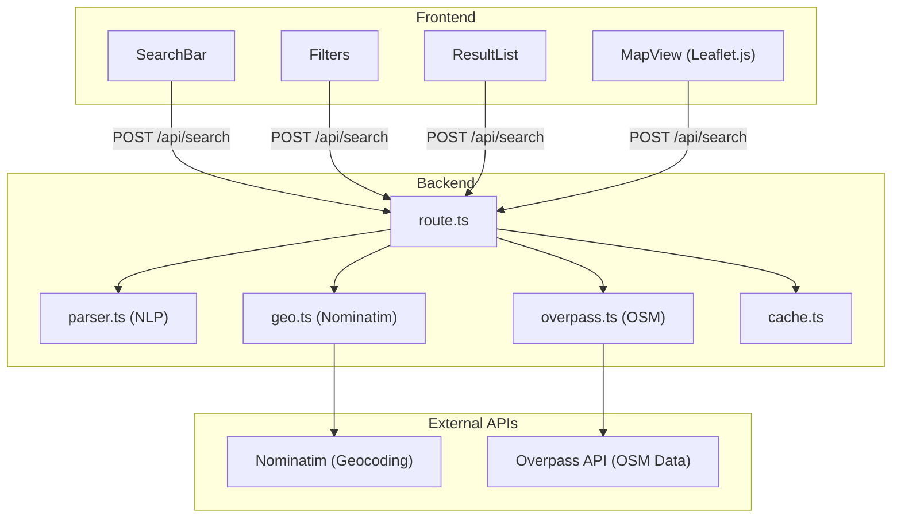

# Sightline

Geospatial infrastructure intelligence platform for discovering and analyzing physical-world assets using OpenStreetMap data.

## Overview

Sightline enables searching, monitoring, and analyzing real-world infrastructure including:

- Telecommunications towers
- Power plants and substations
- Data centers
- Airports and helipads
- Ports and harbours
- Warehouses and industrial facilities
- Pipelines and refineries
- Military installations
- Hospitals, prisons, embassies

## Architecture



## Data Sources

### OpenStreetMap

All infrastructure data comes from [OpenStreetMap](https://www.openstreetmap.org/), a collaborative mapping project. OSM data is crowd-sourced and may contain inaccuracies or gaps.

### Nominatim

Geographic resolution uses the [Nominatim](https://nominatim.openstreetmap.org/) geocoding service to convert place names to bounding boxes and coordinates.

### Overpass API

Infrastructure queries execute against the [Overpass API](https://overpass-api.de/), which provides read-only access to OSM data.

## Query Syntax

### Natural Language

```
telecom towers in karnataka
power plants near mumbai
data centers in california
airports in germany
```

### Structured Queries

```
type:telecom operator:airtel region:karnataka
type:data_center operator:google
type:substation region:texas
type:airport country:france
```

### Supported Parameters

| Parameter | Description | Example |
|-----------|-------------|---------|
| `type:` | Asset type | `type:power_plant` |
| `operator:` | Operator/owner | `operator:google` |
| `region:` | State/region | `region:bavaria` |
| `country:` | Country | `country:india` |
| `near:` | Proximity search | `near:london` |
| `radius:` | Search radius (km) | `radius:100` |

### Supported Asset Types

- `telecom` / `tower` - Telecommunications towers
- `data_center` - Data centers
- `power_plant` - Power generation facilities
- `substation` - Electrical substations
- `airport` - Airports
- `helipad` - Helipads
- `port` / `harbour` - Ports and harbours
- `warehouse` - Warehouses
- `railyard` - Rail yards
- `pipeline` - Pipelines
- `solar` / `wind` / `nuclear` - Renewable/nuclear facilities
- `dam` - Dams
- `military` - Military installations
- `hospital` - Hospitals
- `prison` - Prisons
- `embassy` - Embassies
- `factory` / `industrial` - Industrial facilities

## Development

### Prerequisites

- Node.js 18+
- npm

### Setup

```bash
npm install
npm run dev
```

Open [http://localhost:3000](http://localhost:3000).

### Project Structure

```
app/
├── page.tsx              # Main application page
├── layout.tsx            # Root layout
├── globals.css           # Global styles
└── api/
    └── search/
        └── route.ts      # Search API endpoint

components/
├── SearchBar.tsx         # Query input
├── Filters.tsx           # Filter sidebar
├── ResultList.tsx        # Results display
└── MapView.tsx           # Leaflet map

lib/
├── types.ts              # Type definitions
├── parser.ts             # Query parsing and NLP
├── geo.ts                # Nominatim integration
├── overpass.ts           # Overpass API queries
└── cache.ts              # In-memory caching
```

## Deployment

### Vercel

```bash
npm install -g vercel
vercel
```

### Environment Variables

No environment variables required. The application uses public OpenStreetMap APIs.

### API Rate Limits

- Nominatim: 1 request/second (enforced by Nominatim usage policy)
- Overpass API: Fair use, avoid heavy queries

## Responsible Use

This tool accesses publicly available OpenStreetMap data. Users must:

1. Respect [OpenStreetMap's tile usage policy](https://operations.osmfoundation.org/policies/tiles/)
2. Respect [Nominatim usage policy](https://operations.osmfoundation.org/policies/nominatim/)
3. Respect [Overpass API usage policy](https://wiki.openstreetmap.org/wiki/Overpass_API#Public_Overpass_API_instances)
4. Not use this tool for illegal surveillance or harmful purposes
5. Acknowledge that OSM data may be incomplete or inaccurate
6. Not perform bulk automated queries that overload public infrastructure

The presence or absence of infrastructure in OSM should not be taken as authoritative. Always verify critical information through official sources.

## License

MIT
